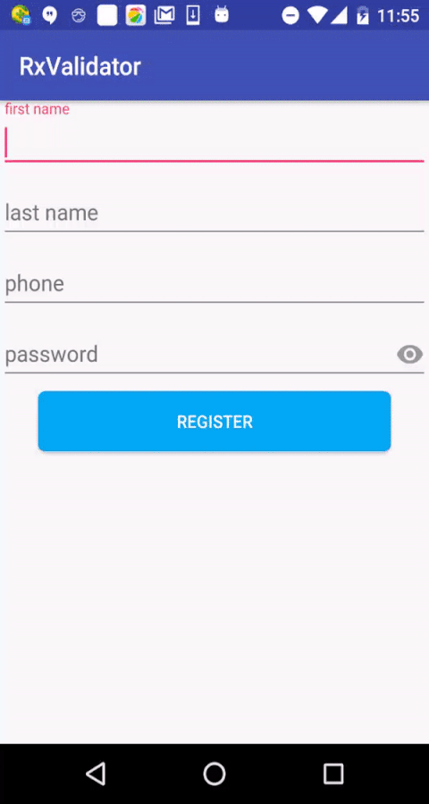

RxValidator is a reactive form validation  for android.



## Usage

##### Step 1 Add dependency

Gradle

``` groovy
compile 'com.malinkang:rxvalidator:0.1'
apt 'com.malinkang:rxvalidator-compiler:0.1'
```

#### Step 2 Annotate your views like this:
``` java
  @NotEmpty(order = 1, message = "FirstName不能为空")
  EditText firstName;
```

#### Step 3 start validate
``` java
      RxValidator.validate(this).subscribe(new Action1<ValidationResult>() {
            @Override
            public void call(ValidationResult validationResult) {
                //...
            }
        });
```

## All supported validation annotations

* @NotEmpty
``` java
    @NotEmpty(order = 1, message = "FirstName不能为空")
    EditText firstName;
```
* @MinLength and @MaxLength
``` java
  @MinLength(order = 6, length = 6, message = "密码长度不能小于6")
  @MaxLength(order = 7, length = 12, message = "密码长度不能大于12")
  EditText password;
```
* @RegExp
``` java
    @NotEmpty(order = 3, message = "手机号不能为空")
    @RegExp(order = 4, message = "请输入正确的手机号", regexp = "^1(3[0-9]|4[57]|5[0-35-9]|7[01678]|8[0-9])\\d{8}")
    EditText phone;
```

License
-------

    Copyright 2016 Linkang Ma

    Licensed under the Apache License, Version 2.0 (the "License");
    you may not use this file except in compliance with the License.
    You may obtain a copy of the License at

       http://www.apache.org/licenses/LICENSE-2.0

    Unless required by applicable law or agreed to in writing, software
    distributed under the License is distributed on an "AS IS" BASIS,
    WITHOUT WARRANTIES OR CONDITIONS OF ANY KIND, either express or implied.
    See the License for the specific language governing permissions and
    limitations under the License.